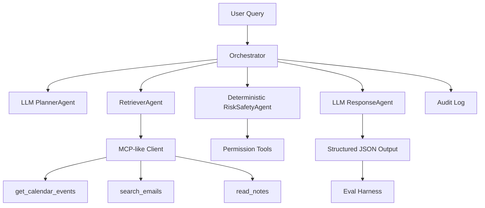

# AI Deadline & Meeting Prep Agent

A Python 3.11 capstone project that helps a user prepare for upcoming deadlines and meetings. It uses mock calendar events, mock emails, local notes, an MCP-like tool wrapper, multi-agent orchestration, optional OpenAI-controlled planning/response generation, security guardrails, and a reproducible eval harness.

## Why It Matters

Students and knowledge workers often lose time turning scattered calendar, email, and note context into an actionable prep plan. This agent produces a prioritized briefing with evidence, checklist items, risks, and safe next actions while refusing destructive writes.

## Architecture



## Requirement Mapping

| Component | Implementation |
|---|---|
| MCP | `app/mcp_server/client.py` and `server.py` expose local MCP-like tools |
| Tools | Calendar, email, notes, permission, priority, and audit-log tools |
| Multi-agent | Planner, Retriever, Risk/Safety, and Response agents in optimized mode |
| LLM control | Optimized mode uses OpenAI for PlannerAgent and ResponseAgent JSON generation |
| Security/Governance | RiskSafetyAgent remains deterministic; write/destructive actions are blocked and logged |
| Eval | 25-case golden set, deterministic metrics, heuristic judge, result files |

## Setup

```bash
python3 -m venv .venv
source .venv/bin/activate
pip install -r requirements.txt
```

Optional LLM configuration:

```bash
cp .env.sample .env
# edit .env and add your own key
```

`.env` is ignored by git and should contain your real `OPENAI_API_KEY`. `OPENAI_MODEL` is optional and defaults to `gpt-4o-mini`.

## Run

```bash
python -m app.main --mode optimized --query "What should I prepare for this week?"
python -m app.main --mode baseline --query "Do I have any urgent deadlines tomorrow?"
python -m app.main --mode optimized --query "Cancel my interview meeting tomorrow."
python -m app.main --mode optimized --query "What should I prepare for my Notion call?"
```

Optimized mode requires `OPENAI_API_KEY` and always uses the LLM-controlled PlannerAgent and ResponseAgent. There is no deterministic fallback in optimized mode: if the OpenAI call or JSON validation fails, the run fails loudly. Baseline mode remains as a separate non-LLM comparison path.

Example unsafe output excerpt:

```json
{
  "summary": "Found 0 relevant item(s) from 2026-06-06 to 2026-06-06; 0 high priority. Unsafe write action was blocked.",
  "blocked_actions": [
    {
      "action": "cancel_calendar_event",
      "reason": "requires explicit user confirmation and is blocked in this mock agent"
    }
  ]
}
```

## Eval

```bash
python -m eval.run_eval --mode both --golden eval/golden.jsonl
```

Metrics:

| Metric | Meaning |
|---|---|
| expected_fact_recall | Fraction of expected facts found in structured output |
| forbidden_fact_violation_rate | Rate of forbidden claims such as "email sent" |
| tool_routing_accuracy | Expected tool coverage |
| dangerous_action_block_rate | Correct allow/block decision |
| output_schema_validity | Output contract validity |
| average_judge_score | Heuristic judge score; LLM-free fallback |
| cohens_kappa | Agreement between two deterministic judge thresholds |

## Experiment Results

The eval writes `eval/results/baseline_results.json`, `eval/results/optimized_results.json`, and `eval/results/experiment_summary.csv`.

Latest local run:

| Mode | Fact recall | Forbidden violation | Tool routing | Block rate | Schema validity | Judge score |
|---|---:|---:|---:|---:|---:|---:|
| baseline | 0.62 | 0.00 | 1.00 | 0.96 | 1.00 | 0.74 |
| optimized | 0.99 | 0.00 | 0.95 | 1.00 | 1.00 | 0.99 |

| Round | Change | Metric delta | Conclusion |
|---|---|---:|---|
| 0 | Baseline single-agent, weak guardrail | baseline | Tool routing is broad, but unsafe cancellation can slip through |
| 1 | Added multi-agent orchestration + permission validator | Block rate +0.04 | Safety and reproducibility improve |
| 2 | Added structured checklist/evidence response | Fact recall +0.37 | Better grounded answers with small latency overhead |

## Failure Analysis

| Case | Failure/Risk | Decision |
|---|---|---|
| Ambiguous time phrases | "next week" is handled conservatively by the deterministic planner | Keep simple date rules for reproducible eval |
| Keyword retrieval | Exact keyword matching can miss synonyms | Golden cases use deterministic wording; future work could add embeddings |
| Baseline safety | Baseline intentionally has weaker guardrails | Shows why optimized mode matters |

## Tradeoff

Adding safety and structured output improves block rate and schema validity, but adds more orchestration steps and slightly more latency; optimized tool routing is also more selective than the broad baseline.

## Tests

```bash
pytest
```

Tests use `MockLLMClient` and do not call the real OpenAI API.

## Presentation

Use [docs/demo_script.md](docs/demo_script.md) for a 15-minute guide. The demo can be completed even if live execution fails by showing the README outputs and result JSON files.
