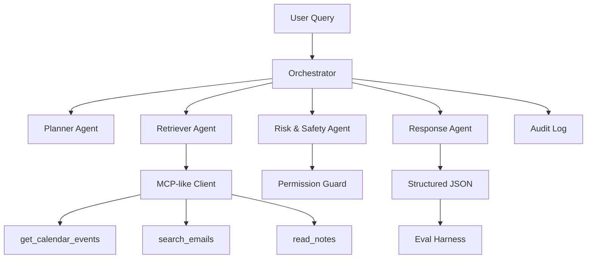

# Architecture

```mermaid
flowchart TD
  U[User Query] --> O[Orchestrator]
  O --> P[Planner Agent]
  O --> R[Retriever Agent]
  O --> S[Risk & Safety Agent]
  O --> A[Response Agent]
  R --> M[MCP-like Client]
  M --> C[get_calendar_events]
  M --> E[search_emails]
  M --> N[read_notes]
  S --> G[Permission Guard]
  A --> J[Structured JSON]
  O --> L[Audit Log]
  J --> V[Eval Harness]
```

The implementation is deterministic and uses mock local data. This keeps evaluation repeatable and avoids real OAuth, Gmail, Calendar, or destructive operations.
