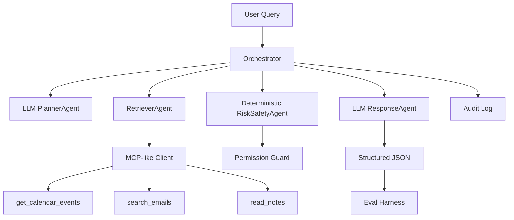

# Architecture

By default the implementation can run deterministically with mock local data. When `--llm` is enabled, PlannerAgent and ResponseAgent use the OpenAI API for structured JSON generation, while RetrieverAgent still performs MCP/tool calls and RiskSafetyAgent remains deterministic for safety.
